# Relatório Técnico - SecureChain Audit

## 1. Contexto da prova prática

O projeto SecureChain Audit atende ao enunciado da prova prática **SecureChain Audit - Plataforma de Auditoria Baseada em Blockchain**, que exige uma solução em Debian 13 com Python 3, Bash Script e Git para controle de usuários, monitoramento de integridade, blockchain de auditoria, criptografia, backup seguro, auditoria da VM e evidências em relatório e vídeo.

Os artefatos de demonstração foram adicionados ao projeto:

- Vídeo demonstrativo: [WhatsApp Vídeo 2026-06-13 at 10.50.43.mp4](evidencias/WhatsApp%20Video%202026-06-13%20at%2010.50.43.mp4)
- Screenshots extraídos: [pasta evidências/screenshots](evidencias/screenshots/)
- Folha de contato dos screenshots: [screenshots_contato.png](evidencias/screenshots_contato.png)

## 2. Arquitetura da solução

A solução foi organizada em módulos independentes, seguindo a estrutura solicitada no PDF da prova:

| Diretório/arquivo | Responsabilidade |
|---|---|
| `usuarios/auth.py` | Cadastro, login, sessão, perfis e autorização por permissão |
| `blockchain/blockchain.py` | Registro de eventos, encadeamento de blocos e validação da cadeia |
| `auditoria/monitor.py` | Cálculo SHA-256 dos documentos e detecção de inclusão, alteração e exclusão |
| `auditoria/auditor.py` | Coleta de `who`, `last -n 30`, `ss -tulpn` e `ip a` |
| `auditoria/analise_seguranca.sh` | Análise ética local com `ss`, `nmap` e revisão de permissões |
| `backup/backup.sh` | Compactação de `documentos/`, criptografia AES e log de backup |
| `configurar_debian.sh` | Criação de usuários Linux, grupos, permissões e ACLs |
| `tests/test_securechain.py` | Testes automatizados dos fluxos críticos |

Todos os eventos relevantes convergem para `blockchain/chain.json`, que funciona como trilha de auditoria persistente. Os relatórios e logs locais facilitam consulta operacional, enquanto os hashes encadeados tornam adulterações detectáveis.

## 3. RF01 - Controle de usuários no sistema operacional

O script `configurar_debian.sh` cria os grupos `securechain_admin`, `securechain_analista` e `securechain_visitante`, além das contas Linux:

- `administrador`: proprietário do projeto e acesso total;
- `analista`: leitura e execução dos módulos;
- `visitante`: acesso restrito, com leitura somente em `auditoria/relatorios`.

O menor privilégio foi aplicado com `chown`, `chmod` e `setfacl`. O diretório raiz fica com modo `0750`, arquivos com `0640`, scripts executáveis com `0750` e ACLs específicas liberam somente o necessário para cada grupo. A segregação de funções impede que o visitante acesse código, backups ou documentos monitorados.

Evidências relacionadas:

| Evidência | Descrição |
|---|---|
| 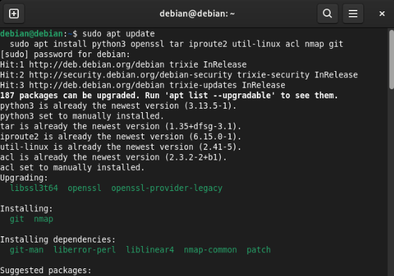 | Instalação de dependências no Debian com `apt`, incluindo OpenSSL, ACL, nmap e Git. |
| 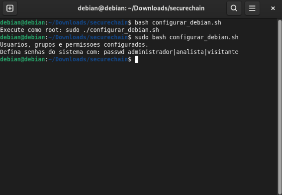 | Execução de `configurar_debian.sh` e validação dos usuários com `id`. |
| 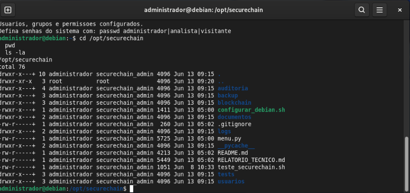 | Conferência de usuários, grupos e permissões do projeto. |
| 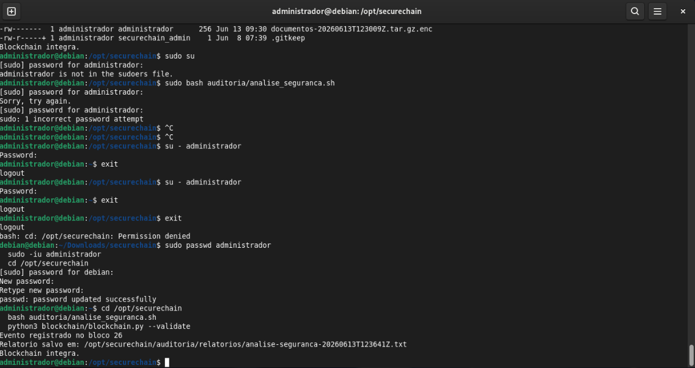 | Teste de restrição de acesso entre usuários Linux. |
| 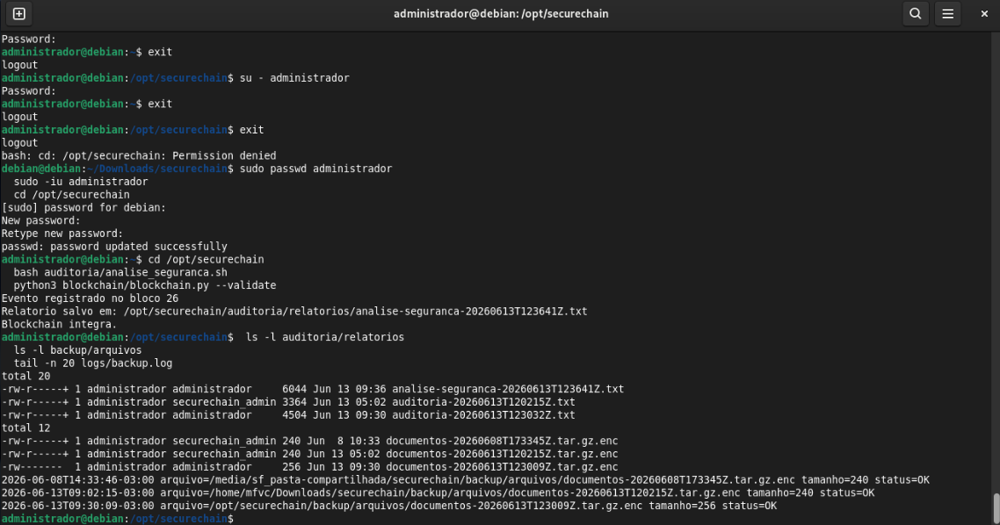 | Validação final de permissões, usuários e arquivos de relatório. |

## 4. RF02 - Sistema de autenticação em Python

O módulo `usuarios/auth.py` implementa cadastro, login, logout, sessão ativa e autorização por perfil. O primeiro usuário pode ser criado sem sessão para inicialização do ambiente; os próximos cadastros exigem permissão `manage_users`.

As permissões da aplicação são separadas por perfil:

| Recurso | admin | analista | visitante |
|---|---:|---:|---:|
| Gerenciar usuários | sim | não | não |
| Inicializar/verificar hashes | sim | sim | não |
| Backup e auditoria | sim | sim | não |
| Ler blockchain | sim | sim | sim |
| Ler relatórios | sim | sim | sim |
| Registrar evento manual | sim | não | não |

Senhas não são armazenadas em texto puro. O projeto usa PBKDF2-HMAC-SHA256 com salt aleatório de 16 bytes, 200.000 iterações e comparação com `hmac.compare_digest`. Cada login bem-sucedido, tentativa negada, criação ou remoção de usuário gera evento na blockchain.

Evidências relacionadas:

| Evidência | Descrição |
|---|---|
| 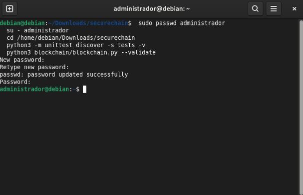 | Definição de senha do usuário administrador no sistema operacional. |
| 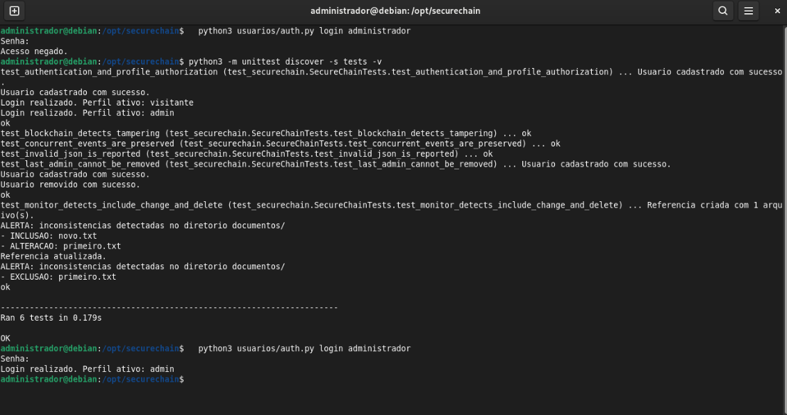 | Criação de usuário e login no sistema SecureChain. |
| 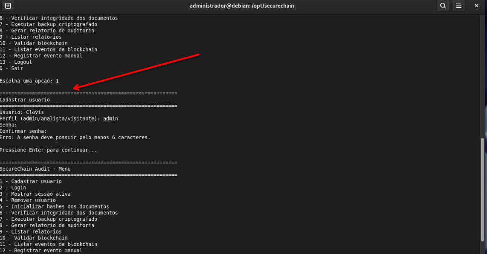 | Menu da aplicação e validação de senha no cadastro. |
| 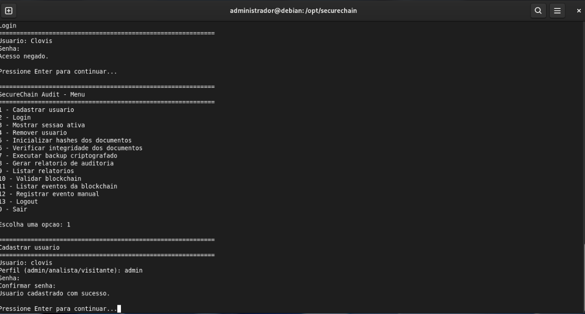 | Cadastro de usuário visitante e retorno ao menu. |
| 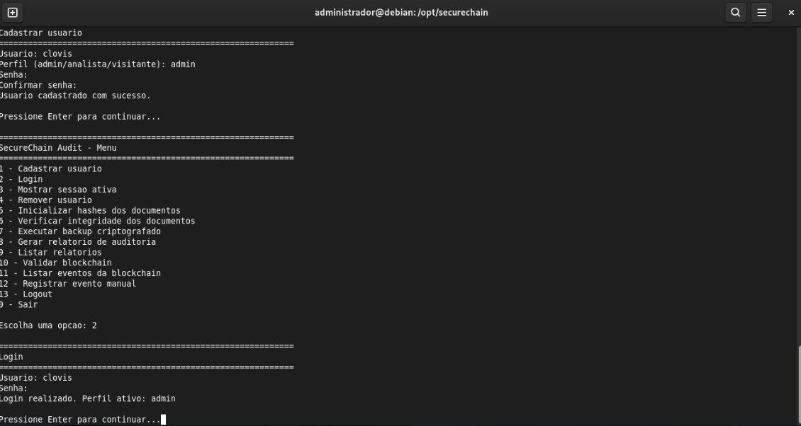 | Login de usuário e exibição de opções conforme perfil. |
| 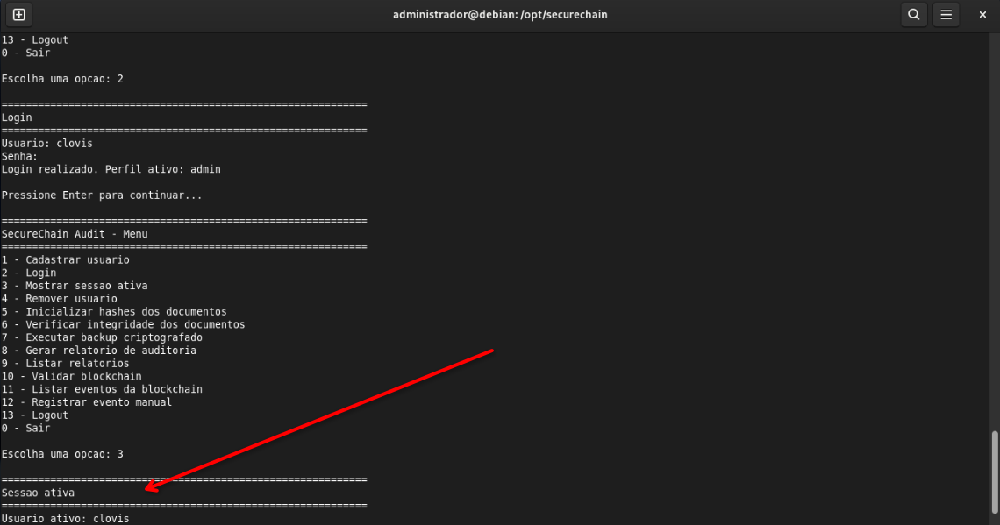 | Encerramento de sessão e novo fluxo de autenticação. |
| 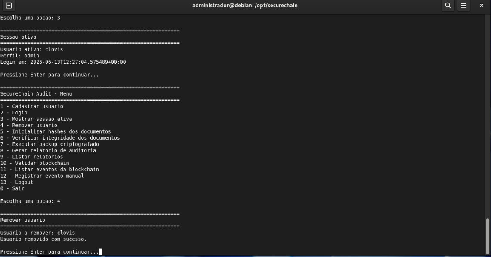 | Sessão ativa, criação de usuário e controle de perfil. |
| 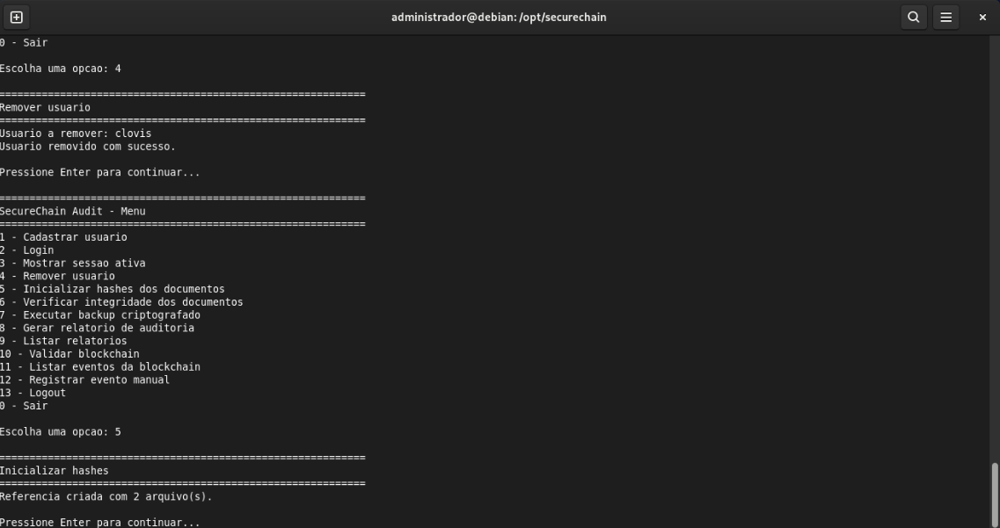 | Remoção de usuário e atualização do estado da aplicação. |

## 5. RF03 - Monitoramento de integridade de arquivos

O diretório `documentos/` é monitorado por `auditoria/monitor.py`. Ao executar `--init`, o sistema calcula SHA-256 de todos os arquivos e salva a referência em `auditoria/hashes_documentos.json`. Ao executar `--check`, o estado atual é comparado com a referência.

O monitor detecta e registra:

- inclusão de arquivo;
- alteração de conteúdo;
- exclusão de arquivo.

Quando há divergência, o terminal exibe alerta e cada inconsistência vira um bloco individual na blockchain. A opção `--update-reference` permite atualizar a linha de base após uma verificação controlada.

Evidências relacionadas:

| Evidência | Descrição |
|---|---|
| 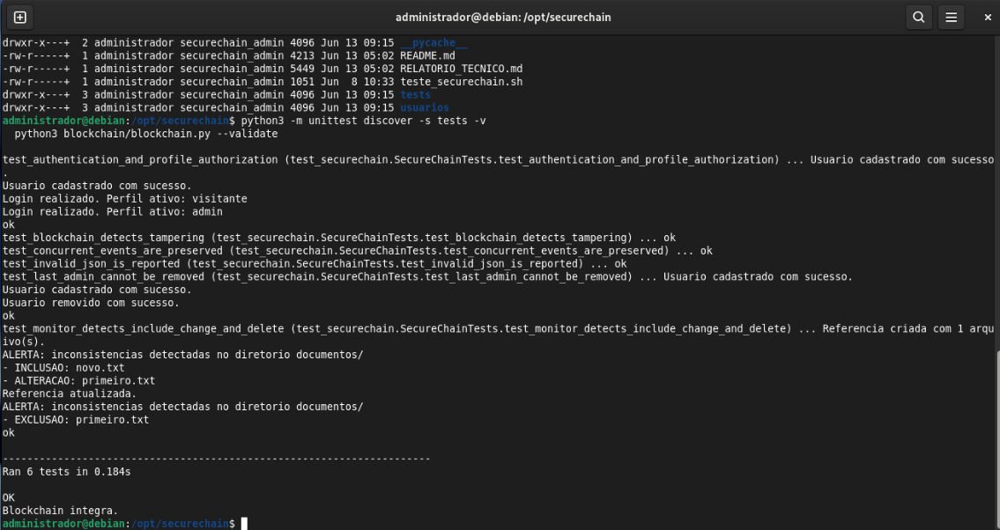 | Testes automatizados cobrindo inclusão, alteração e exclusão de documentos. |
| 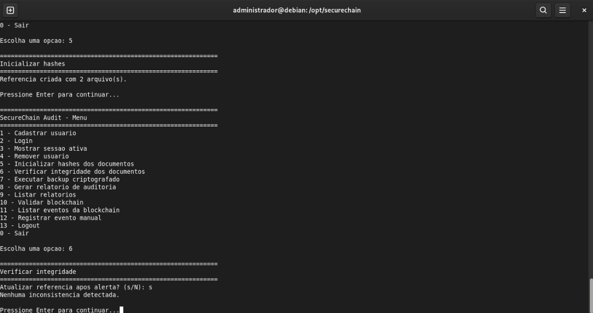 | Inicialização/verificação da referência de hashes dos documentos. |
| 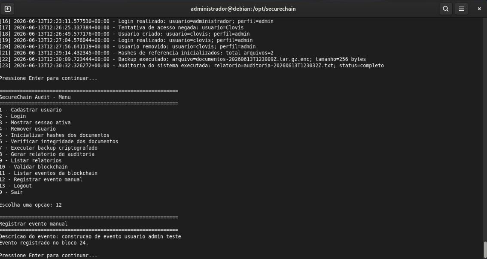 | Eventos de monitoramento registrados junto dos demais eventos da blockchain. |

## 6. RF04 e RF07 - Blockchain de auditoria e validação

Cada evento relevante gera um bloco em `blockchain/chain.json`. Cada bloco contém:

| Campo | Finalidade |
|---|---|
| `id` | identificador sequencial único |
| `timestamp` | data e hora em ISO 8601 |
| `evento` | descrição textual do evento |
| `hash_anterior` | hash SHA-256 do bloco anterior |
| `hash_atual` | hash SHA-256 calculado sobre os campos do bloco |

Antes de registrar um novo evento, `registrar_evento` válida a cadeia atual. Se houver JSON inválido, hash recalculado diferente, quebra de encadeamento, ID fora de sequência, campo obrigatório ausente ou timestamp inválido, o sistema bloqueia novos registros e mostra alerta.

A gravação da cadeia é atômica, usando arquivo temporário e `os.replace`, e há bloqueio de arquivo com `fcntl.flock` para reduzir risco de escrita concorrente. Os testes também validam preservacao de eventos concorrentes.

Evidências relacionadas:

| Evidência | Descrição |
|---|---|
|  | Testes de adulteração, JSON inválido, autorização e concorrência da blockchain. |
| 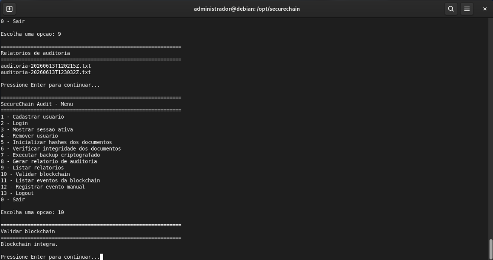 | Validação da blockchain íntegra pelo menu da aplicação. |
| 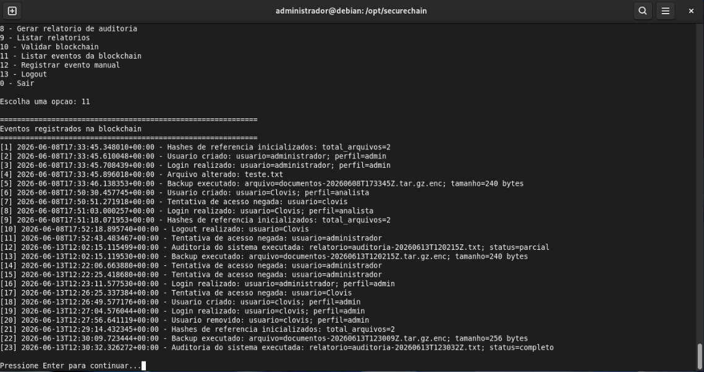 | Listagem de eventos registrados na blockchain. |

## 7. RF05 - Backup seguro automatizado

O script `backup/backup.sh` compacta o diretório `documentos/` em `.tar.gz`, criptografa o arquivo com OpenSSL e remove o temporário não criptografado por `trap`.

O algoritmo escolhido foi **AES-256-CBC com salt e PBKDF2**, por estar disponível nativamente no Debian via OpenSSL, ser eficiente para arquivos e adequado para criptografia simétrica de backups. O projeto evita expor a senha na linha de comando ao usar `-pass fd:3`.

Limitação técnica: CBC não fornece autenticação integrada. Como melhoria, recomenda-se migrar para AES-256-GCM ou adicionar HMAC para detectar adulteração do backup criptografado.

Evidências relacionadas:

| Evidência | Descrição |
|---|---|
| 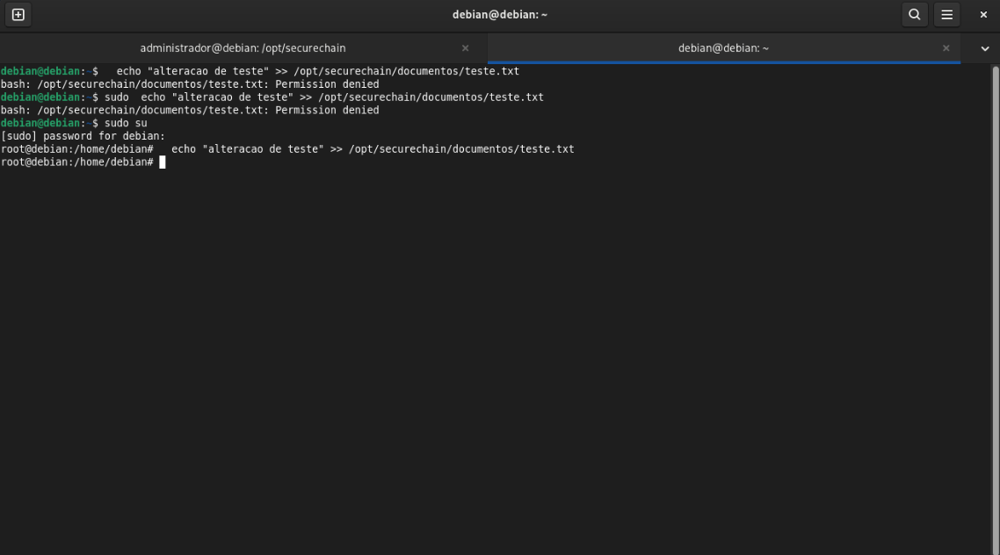 | Execução de backup com senha para criptografia. |
| 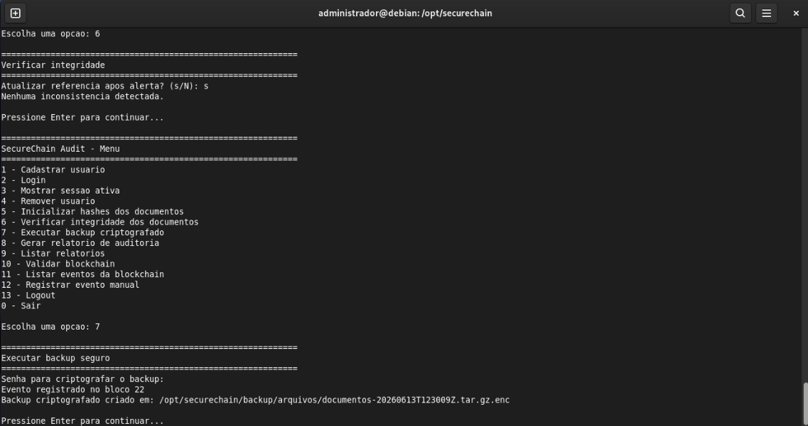 | Backup criptografado gerado em `backup/arquivos`. |
| 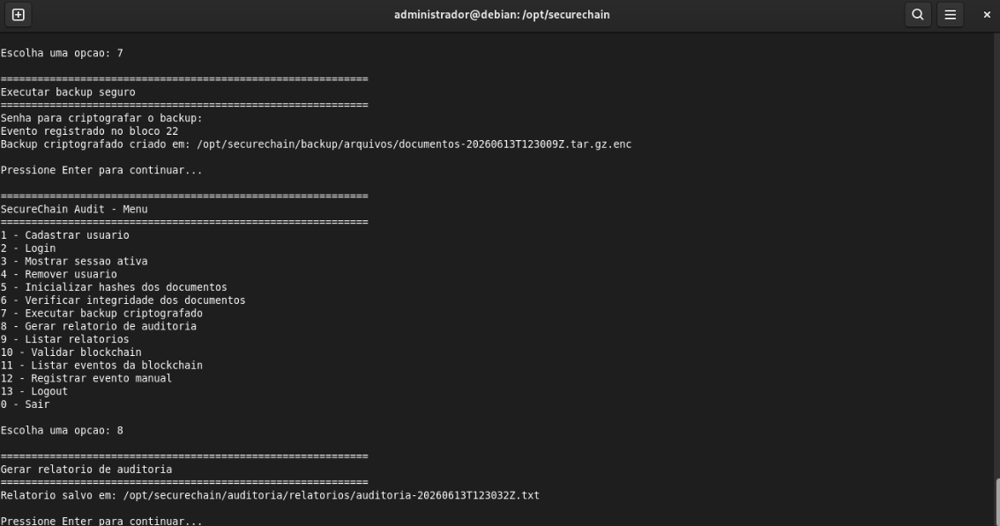 | Registro local do backup e status da operacao. |
|  | Evento de backup registrado na blockchain. |

## 8. RF06 - Auditoria do sistema operacional

O módulo `auditoria/auditor.py` gera relatórios datados em `auditoria/relatorios/`, coletando:

- `who`: usuários conectados;
- `last -n 30`: histórico recente de logins;
- `ss -tulpn`: portas e serviços em escuta;
- `ip a`: interfaces de rede e endereços IP.

O script `auditoria/analise_seguranca.sh` complementa a auditoria com `nmap -sV --top-ports 100 localhost`, listagem de portas com `ss` e revisão de permissões do projeto com `find`.

Evidências relacionadas:

| Evidência | Descrição |
|---|---|
| 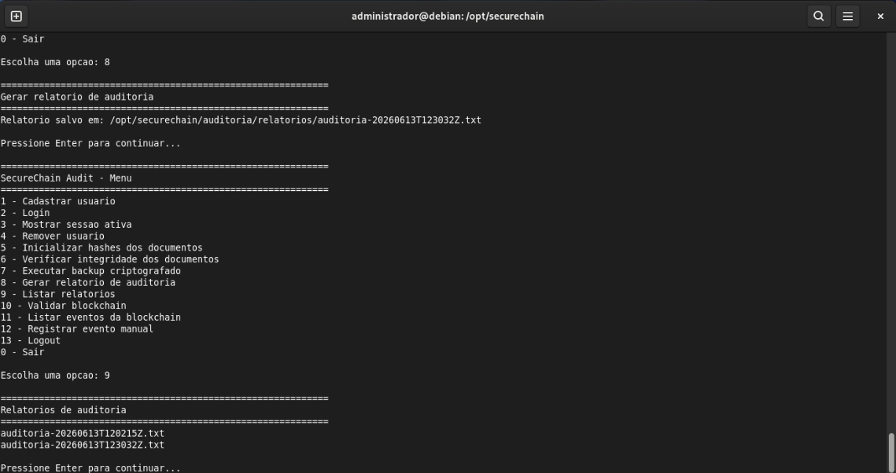 | Relatório de auditoria do sistema operacional gerado. |
|  | Listagem de relatórios gerados em `auditoria/relatorios`. |
| 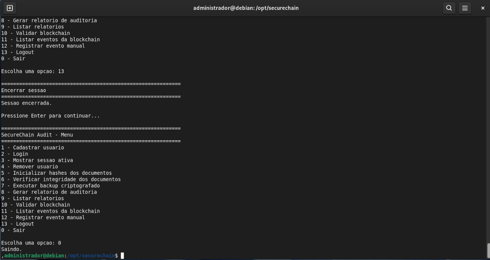 | Menu de auditoria e execução de funcionalidades administrativas. |
|  | Saída de análise de permissões e arquivos de relatório. |

## 9. Criptografia aplicada

| Contexto | Mecanismo | Justificativa |
|---|---|---|
| Senhas | PBKDF2-HMAC-SHA256, salt aleatório e 200.000 iterações | Evita texto puro, dificulta tabelas pré-calculadas e aumenta custo de força bruta |
| Integridade de arquivos | SHA-256 | Permite detectar alterações nos documentos monitorados |
| Integridade da blockchain | SHA-256 encadeado | Torna adulterações detectáveis ao recalcular os blocos |
| Backups | AES-256-CBC com salt e PBKDF2 via OpenSSL | Criptografia simétrica eficiente e disponível no Debian |

## 10. Zero Trust Security

1. **Verificação de identidade:** cada acesso exige login com senha derivada por PBKDF2 e sessão válida. A sessão expira após oito horas.
2. **Controle e auditoria de permissões:** cada ação protegida chama `require_permission`, que recalcula a autorização a partir do perfil ativo. Negativas de acesso também são registradas na blockchain.
3. **Menor privilégio na prática:** há duas camadas de restrição: ACLs/grupos no Linux e matriz de permissões na aplicação.
4. **Registro imutável de ações:** logins, negações, criação/remoção de usuários, alterações de arquivos, backups e auditorias são registrados em blocos encadeados.

Limitação: `chain.json` ainda é um arquivo local. Para maior imutabilidade operacional, recomenda-se cópia append-only em host remoto, assinatura digital periódica ou armazenamento WORM.

Evidências relacionadas:

| Evidência | Descrição |
|---|---|
|  | Login e exibição de opções conforme o perfil ativo. |
|  | Restrição real de acesso no sistema operacional para usuário sem privilégio. |
|  | Ações registradas em trilha encadeada e verificável. |

## 11. Hacking etico - análise da VM

A análise da própria VM deve ser registrada com os relatórios gerados por `auditoria/analise_seguranca.sh` e `auditoria/auditor.py`. Com base no que o projeto coleta, a matriz de achados deve ser preenchida após a execução final no Debian:

| Achado | Evidência | Risco | Correção aplicada/proposta |
|---|---|---|---|
| Portas/serviços em escuta | Relatório de `ss -tulpn` e `nmap` | Exposição indevida de serviços | Desativar serviço desnecessário, restringir interface ou aplicar firewall |
| Permissão excessiva | Saída de `find` e ACLs | Leitura ou alteração por usuário indevido | Ajustar `chmod`, `chown`, grupos e `setfacl` |
| Pacote ausente/desatualizado | Saída de instalação e auditoria | Falha de execução ou risco conhecido | Instalar/atualizar pacotes com `apt` |
| Logs locais alteráveis | Arquivos em `logs/` | Evidência local pode ser apagada | Registrar também na blockchain e replicar para host remoto |

Não se deve declarar uma vulnerabilidade como corrigida sem repetir o teste e guardar a evidência correspondente.

Evidências relacionadas:

| Evidência | Descrição |
|---|---|
|  | Instalação das ferramentas de apoio para auditoria, incluindo `nmap`. |
|  | Geração de relatório com dados da VM. |
|  | Revisão de permissões usada como parte da análise de segurança. |

## 12. Engenharia de software segura

| Falha ou vulnerabilidade | Mitigação no projeto |
|---|---|
| Senhas em texto puro | PBKDF2-HMAC-SHA256, salt aleatório e arquivo `users.json` restrito |
| Permissoes excessivas | Grupos Linux, `chmod`, `chown`, ACLs e matriz de perfis |
| Ausência de logs de eventos | Logs locais e blockchain persistente |
| Ausência de validação de entrada | Perfis enumerados, senha mínima, evento não vazio e validação JSON |
| Corrupção silenciosa da blockchain | Validação recalcula hashes e bloqueia novos registros inconsistentes |
| Vazamento de senha do backup | Senha lida de forma interativa ou por variável protegida e enviada ao OpenSSL por descritor |
| Arquivo parcial após falha | Gravação atômica da blockchain e remoção do `.tar.gz` temporário |
| Remoção indevida do último admin | Regra impede excluir o último usuário com perfil `admin` |

## 13. Testes e comandos de evidência

Os testes automatizados cobrem adulteração da blockchain, JSON inválido, concorrência, autenticação, autorização, monitoramento de documentos e proteção do último administrador.

Comandos usados ou recomendados para evidenciar a entrega:

```bash
sudo ./configurar_debian.sh
id administrador
id analista
id visitante
getfacl auditoria/relatorios
find . -maxdepth 2 -printf '%M %u:%g %p\n'

python3 usuarios/auth.py create-user administrador admin
python3 usuarios/auth.py login administrador
python3 menu.py

python3 auditoria/monitor.py --init
python3 auditoria/monitor.py --check
python3 blockchain/blockchain.py --validate
python3 auditoria/auditor.py
./auditoria/analise_seguranca.sh
./backup/backup.sh

python3 -m unittest discover -s tests -v
bash teste_securechain.sh
```

## 14. Vídeo demonstrativo

O vídeo em MP4 demonstra a VM Debian em execução e os fluxos principais pedidos no enunciado: login, geração de bloco, monitoramento de arquivo, validação da blockchain e backup criptografado.

[Abrir vídeo demonstrativo](evidencias/WhatsApp%20Video%202026-06-13%20at%2010.50.43.mp4)

## 15. Limitações e melhorias futuras

- Migrar o backup para AES-256-GCM ou adicionar HMAC aos arquivos criptografados.
- Replicar a blockchain para armazenamento remoto append-only ou WORM.
- Adicionar MFA e bloqueio progressivo após falhas de login.
- Integrar `systemd` timers para monitoramento e backup periódico.
- Assinar digitalmente relatórios de auditoria.
- Exportar métricas e alertas para monitoramento centralizado.
- Formalizar no README a divisão de tarefas da equipe e relacionar commits aos requisitos da prova.
